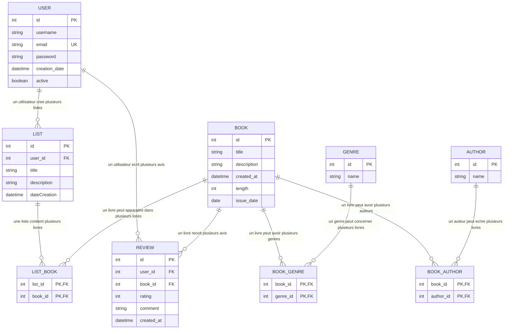

# bdd schema

## Lecture du schema

- `USER` et `LIST` sont en one-to-many : un utilisateur peut creer plusieurs listes, chaque liste appartient a un seul utilisateur.
- `LIST` et `BOOK` sont en many-to-many via `LIST_BOOK` : une liste contient plusieurs livres, et un livre peut apparaitre dans plusieurs listes.
- `REVIEW` relie un utilisateur a un livre avec une note et un commentaire.
- `BOOK_GENRE`, `BOOK_AUTHOR` et `LIST_BOOK` sont des tables de jointure.

## Legende des notations

- `||` : exactement un
- `o{` : zero a plusieurs
- `PK` : cle primaire
- `FK` : cle etrangere
- `UK` : contrainte d'unicite

Exemples :

- `USER ||--o{ LIST` : un utilisateur peut avoir plusieurs listes, mais une liste appartient a un seul utilisateur.
- `BOOK ||--o{ REVIEW` : un livre peut avoir zero, un ou plusieurs avis.
- `LIST ||--o{ LIST_BOOK` et `BOOK ||--o{ LIST_BOOK` : la relation entre listes et livres passe par une table de jointure, donc c'est un many-to-many.
